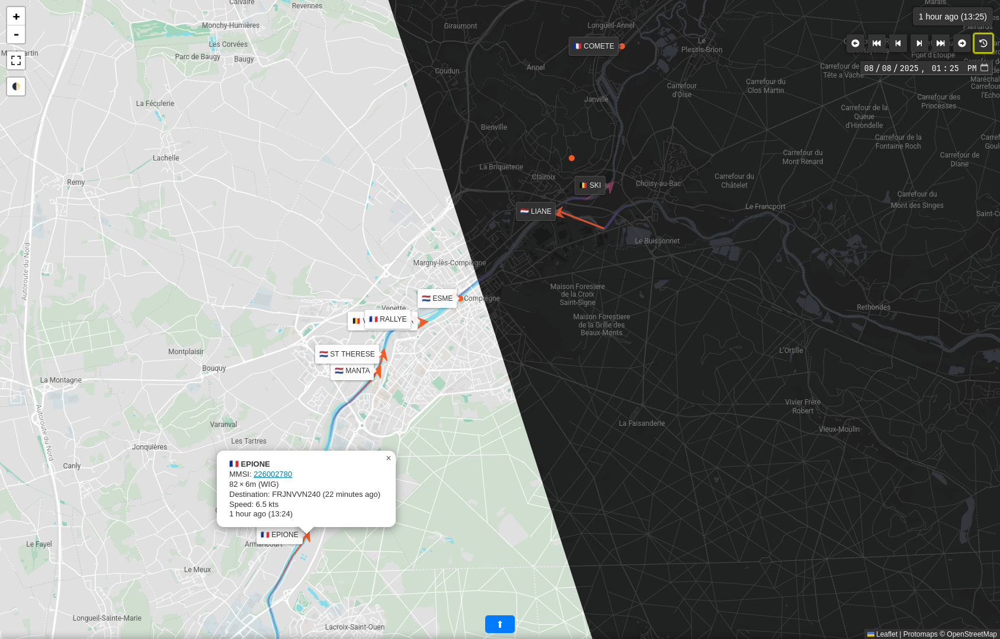

# Batellerie

_This repository contains the source code for the application hosted at https://ais.glost.is._

## Context

I live close to the [Oise](https://en.wikipedia.org/wiki/Oise_(river)) river in France.
I operate an [AIS](https://en.wikipedia.org/wiki/Automatic_identification_system) receiving station at home (the station
was [kindly provided by MarineTraffic](https://www.marinetraffic.com/en/join-us/cover-your-area)) which enables me to
catch the AIS messages sent by all the vessels going up and down the river (mostly freight barges).

The data is automatically uploaded to the MarineTraffic data feed, but I also have the option to forward it
to an endpoint of my choice. I forward it to my VPS which stores the streamed raw AIS data, decodes it, stores it
in a database, and serves it on the web frontend.



## How it works

The application is divided in two parts:

- the backend, which receives, decodes, and stores the AIS messages in a database
- the frontend which queries AIS messages from the database and displays them on a map.

### Backend

The backend has two services - `store` and `sync`:

- `store` listens for raw AIS messages sent by my AIS receiving station on the UDP stream and appends them as-is to a
    file on disk.
- `sync` runs every 30 seconds. It compares the contents of the file containing the raw AIS messages and the
    [duckdb](https://duckdb.org/) database containing the decoded AIS messages, and decodes (using
    [pyais](https://github.com/M0r13n/pyais)) then inserts in the duckdb database any new raw messages not yet in DB.

The goal was to have a simple yet resilient system that does not drop any received messages in case of a problem (loss
of connection to the database, uncaught error when decoding the raw messages), hence the two-step process.

### Frontend

_Disclaimer: I am very amateurish at developing frontend applications.
The code is mostly some ugly LLM-sourced vanilla Javascript iterated on until it does what I want…_

The client-side frontend communicates with a simple server-side flask API that serves all the AIS messages contained
between two given timestamps.

The individual AIS messages containing position and speed information (AIS message type 1/2/3) are grouped into a
single track per ship, and static data relevant to the ship (its name, type, dimensions) and voyage data
(AIS message type 5) is added to the track.

The user can use buttons to play back through past tracks.

## Providing data

### AIS data

AIS data is stored to `./batellerie/data/messages.(txt|db)`.

### Map base layer

The map base layer is provided as a single static file `./batellerie/static/map.pmtiles` thanks to
[protomaps](https://protomaps.com/).
It can be created using the following command:

```bash
pmtiles extract https://build.protomaps.com/20250804.pmtiles static/map.pmtiles --bbox 2.6,49.25,3.1,49.55
```
